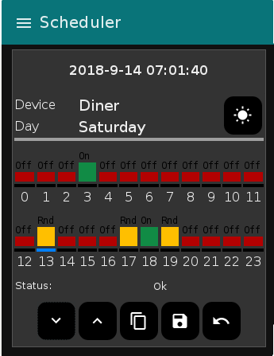

# hemnode
My home automation project to control lights and equipment in my house based
on node-red and a few additional nodes. It allows to control lights and 
equipment based on solar events (for the moment this is fixed in the flow) or
based on a schedule.

  

The scheduler is based on: [Hourly ON/OFF Week Scheduler Dashboard - DEHN.IO v0.1](https://gist.github.com/3b031629c8450d2098dd3183ccf84be4)

It has been extended to allow setting a random time (Rnd) with the following 
logic:
* A random start section will turn on the device within the first 30 minutes
of the indicated hour
* A random end section will turn off the device in the last 30 minutes of 
the indicated hour

# Installation

1. Install tellstick: 
1. Install [node-red](https://nodered.org/docs/getting-started/)
1. Install the following nodes
   - [dashboard](https://github.com/node-red/node-red-dashboard)
   - [sunevents](https://github.com/freakent/node-red-contrib-sunevents)
   - [tellstick](https://github.com/emiloberg/node-red-contrib-tellstick)
1. Import the flows and deploy them
1. Adjust flows to your devices, initialization should put all configured 
receivers in the debug tab (copied from tellstick configuration in /etc/tellstick.conf)
  
# License

Copyright (c) 2017 Robert Schmersel (roscopc666@gmail.com)

Permission to use, copy, modify, and distribute this software for any
purpose with or without fee is hereby granted, provided that the above
copyright notice and this permission notice appear in all copies.

THE SOFTWARE IS PROVIDED "AS IS" AND THE AUTHOR DISCLAIMS ALL WARRANTIES
WITH REGARD TO THIS SOFTWARE INCLUDING ALL IMPLIED WARRANTIES OF
MERCHANTABILITY AND FITNESS. IN NO EVENT SHALL THE AUTHOR BE LIABLE FOR
ANY SPECIAL, DIRECT, INDIRECT, OR CONSEQUENTIAL DAMAGES OR ANY DAMAGES
WHATSOEVER RESULTING FROM LOSS OF USE, DATA OR PROFITS, WHETHER IN AN
ACTION OF CONTRACT, NEGLIGENCE OR OTHER TORTIOUS ACTION, ARISING OUT OF
OR IN CONNECTION WITH THE USE OR PERFORMANCE OF THIS SOFTWARE.

